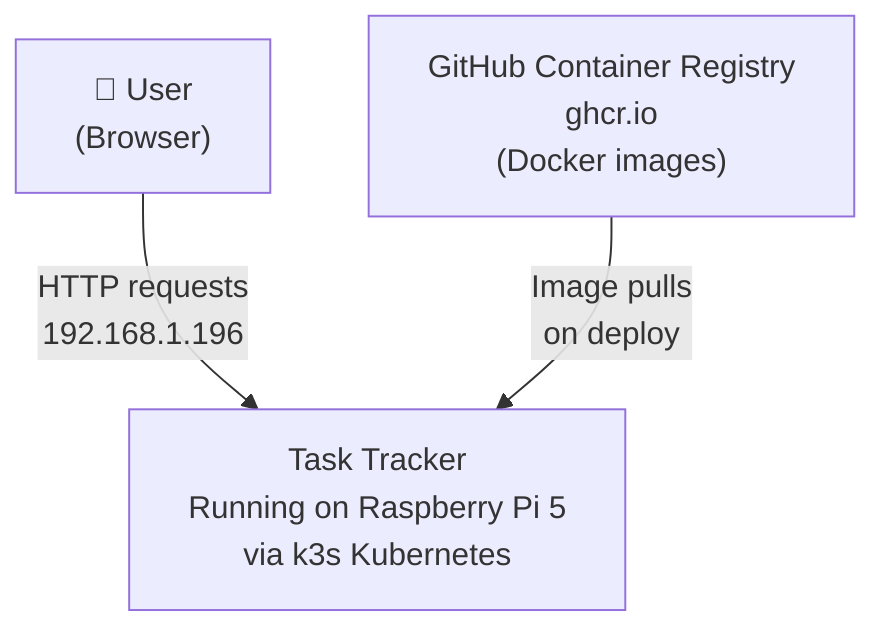
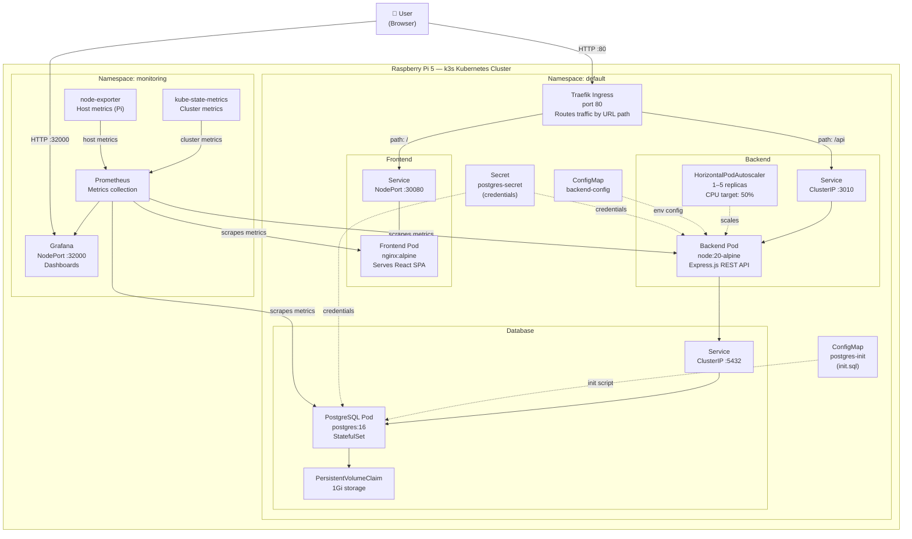
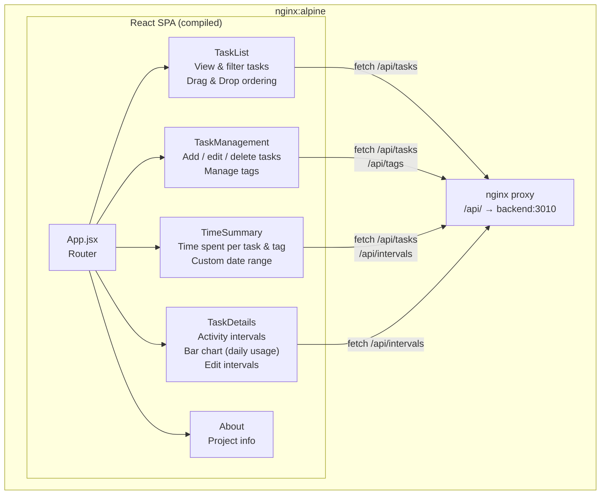
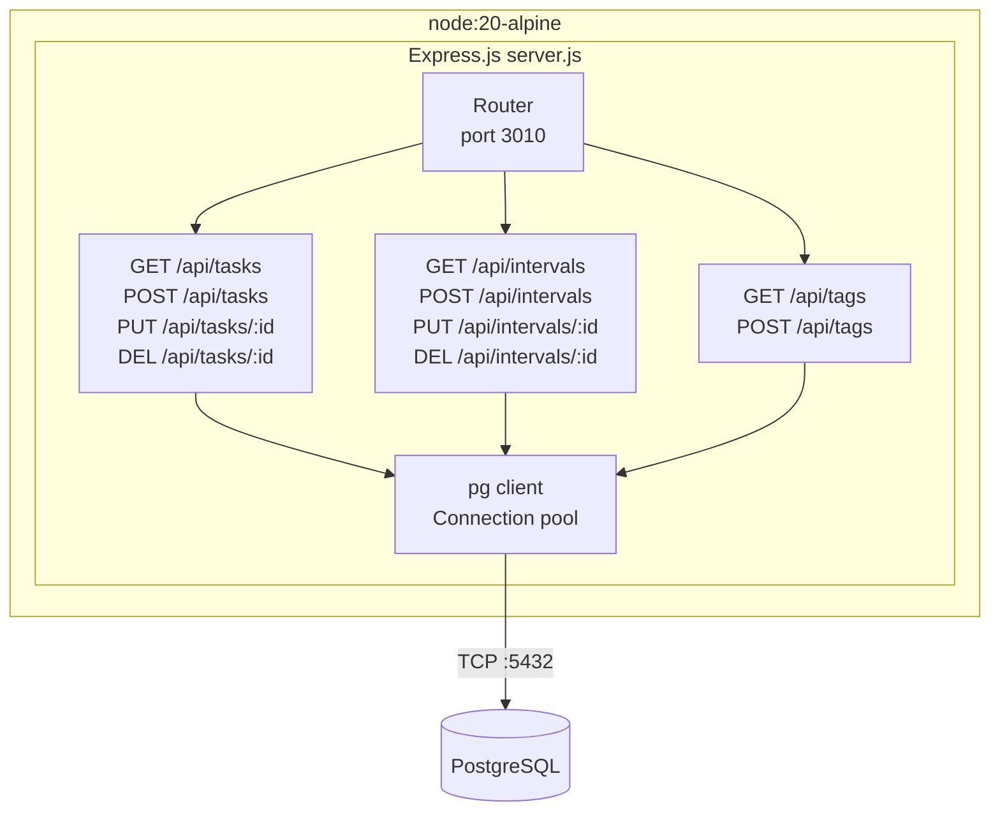
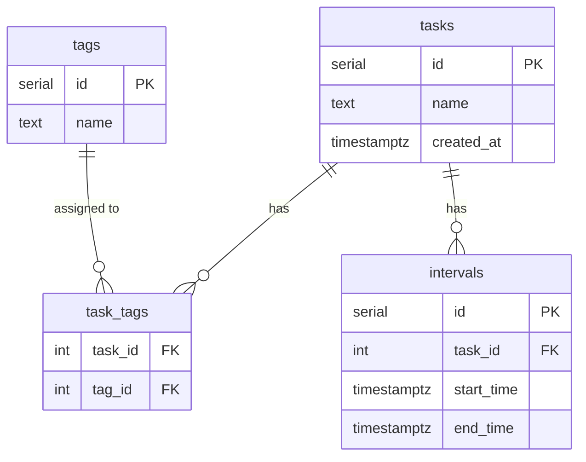

# Architecture

## Context

> Who uses the system and how it fits into the world.

---

## Container

> The Kubernetes workloads and services inside the cluster.

---

## Component

> What is inside each container.

### Frontend (React + nginx)

### Backend (Express.js)

### Database (PostgreSQL)

---

## Kubernetes Resource Summary

| Resource | Name | Namespace | Purpose |
|---|---|---|---|
| Deployment | frontend | default | Runs nginx + React SPA |
| Deployment | backend | default | Runs Express.js API |
| StatefulSet | postgres | default | Runs PostgreSQL with stable storage |
| Service (NodePort) | frontend | default | Exposes app on port 30080 |
| Service (ClusterIP) | backend | default | Internal access to API on port 3010 |
| Service (ClusterIP) | postgres | default | Internal access to DB on port 5432 |
| Ingress | task-tracker-ingress | default | Routes `/api` → backend, `/` → frontend |
| HorizontalPodAutoscaler | backend-hpa | default | Scales backend 1–5 pods at 50% CPU |
| PersistentVolumeClaim | postgres-pvc | default | 1Gi persistent storage for database |
| ConfigMap | backend-config | default | DB host, port, name env vars |
| ConfigMap | postgres-init | default | SQL init script run at DB startup |
| Secret | postgres-secret | default | DB username and password |
| Helm Release | monitoring | monitoring | Prometheus + Grafana stack |
| Service (NodePort) | monitoring-grafana | monitoring | Exposes Grafana on port 32000 |
